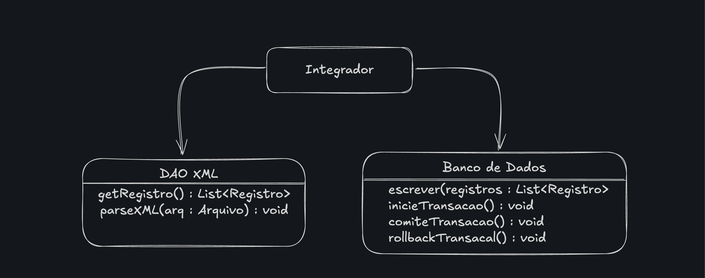
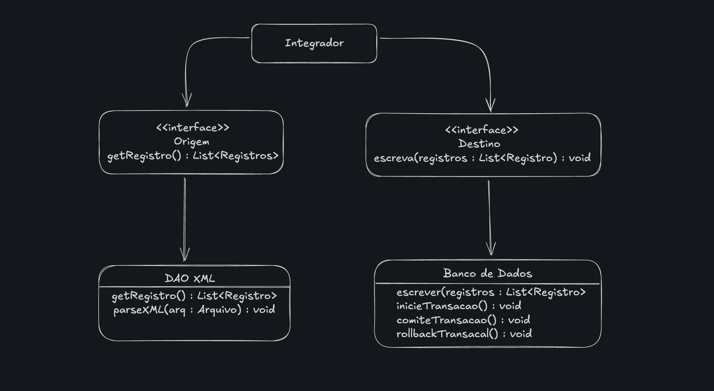

# O Problema do Alto Acoplamento

Spring Framework é um framework voltado para o desenvolvimento de aplicações corporativas para a plataforma Java, baseado no conceito de inversão de controle (IoC) com o container de injeção de dependências (DI).

Mas de fato, quais problemas motivaram sua criação? A resposta se encontra nos problemas comuns no desenvolvimento de software que ocorrem independete da plataforma.

*Fred Brooks,* em *"No Silver Bullet"*, aponta quatro **dificuldades essenciais** inerentes ao desenvolvimento de qualquer software

1. **Conformidade**: todo software precisa ser compatível com o ambiente no qual será executado. Ao mesmo tempo, a conformidade com o sistema operacinal, ao acesso a interfaces de sistemas legados, restringe o sistema às limitações impostas por suas próprias plataformas.

> *“acesso a interfaces de sistemas legados”*, está se referindo ao fato de que software raramente nasce do zero em um vácuo. Quase sempre, precisamos conectar o novo ao que já existe — e esse "já existe" geralmente são sistemas antigos (legados) que ainda cumprem funções críticas dentro da organização.

> são pontos de comunicação expostos por softwares mais antigos, normalmente construídos em tecnologias ultrapassadas ou pouco flexíveis. São “as portas de entrada/saída” desses sistemas para que novas aplicações consigam interagir com eles.


2. **Invisibilidade**: traduzida como a dificuldade visual de representar um software.

3. **Mutabilidade**: os requisitos do projeto mudam constantemente, e isso exige que a arquitetura do sistema seja projetada para se adequar com o mínimo de impacto possível a essas transformações. É justamente nesse ponto que o paradigma orientado a objetos brilha.

4. **Complexidade**: diretamente relacionado aos limites do nosso intelecto. Conforme o software se desenvolve, evolue também seu grau de complexidade.

A orientação a objetos tropeça no problema da complexidade: se já há complexidade no desenvolvimento procedural, com objetos em cena acabamos por adicionar também a complexidade inerente ao gerenciamento das interações entre objetos.

*Robert C. Martin (Uncle Bob)*, em *The Dependency Inversion Principle* aponta sintomas que indicam a dificuldade de escalabilidade do projeto:

* **Fragilidade**: altere uma linha de código, veja diversas outras se partirem.

* **Rigidez**: consequência da fragilidade, o software é difícil de ser modificado.

* **Imobilidade**: apesar de possuir componentes maravilhosos no software, que poderiam ser reaproveitados, infelizmente sua remoção é tão custosa que é mais barato reimplementar a funcionalidade (isso significa manutenção em mais de um lugar!).

**O que torna um projeto frágil, rígido e imóvel é a maneira como se encontra definida a interdependência entre seus componentes.**

O alto acoplamento acontece quando as classes do seu projeto dependem demais uma das outras. Quando mais uma classe sabe a respeito da outra, maior é o acoplamento entre as duas e, consequentemente, alterações em uma levam a comportamentos inesperados no sistema.

---

## O Princípio de Inversão de Dependências

Para expor o problema do acoplamento, vamos implementar um ETL simples: uma aplicação de integração.

> ETL (Extract, Transform, Load) é um sistema de integração de dados que coleta informações de várias fontes de dados, as limpa e organiza de acordo com regras de negócio, e as carrega num repositório centralizado, como um banco de dados (ETLs comuns costumam ser centralizados em um data warehouse ou data lake). Este processo é essencial para consolidar dados brutos para análises, relatórios e tomada de decisões.

Nosso ETL será formado basicamente por três classes:

* Um `DAO` (Extract -- fonte de dados)

* O `Integrador` em si (Transform -- algoritmos de otimização, regras de negócio)

* Um `Banco de Dados` (Load -- onde os dados transformados são carregados no sistema de destino)

---

### O que é um `DAO`?

DAO significa *Data Acess Object*. É um padrão de design que tem por objetivo separar a lógica de negócio da aplicação da lógica de acesso aos dados. Ele atua então como uma camada específica para persistência de dados.

* O código de acesso a dados implementa uma interface genérica para interagir com os dados, escondendo os detalhes internos de como os dados são armazenados e recuperados

* Precisou trocar a fonte de dados? Crie uma nova implementação dessa interface. *"Mas como meu sistema saberá qual implementação usar?"*, esse é justamente o papel do Spring: fornecer um container que injeta a dependência.

---

### V1 ETL



*Dependência* diz respeito a o que o projeto depende, obrigatoriamente, para existir. Nesse caso, o `Integrador`, precisa de duas dependências: `Banco de Dados`, `DAO XML`

Aqui esbarramos novamente com as dificuldades essenciais do desenvolvimento de qualquer software:

1. **Conformidade**: tanto a classe de acesso ao banco quanto DAO que acessa docs XML precisam estar de acordo com as limitações impostas pelo sistema gerenciados de bancos de dados escolhido e pelas restrições de esquema XML.

* O problema é que `Integrador` possui acesso direto aos campos públicos de suas dependências e, portanto, acesso aos seus detalhes de implementação internos.

* Isso corrompe com a escalabilidade do sistema porque ocorre a quebra do encapsulamento, porque o `Integrador` se preocupa demais com a conformidade de suas dependências, enquanto deveria acessar apenas interfaces.

2. **Mutabilidade**: e se no futuro houver necessidade de buscarmos dados não de arquivos XML, mas de outro banco de dados ou se o destino não for mais um banco de dados, mas um web service? Ainda pior: e se o client quiser decidir qual fonte e destino usar em tmepo de execução?

* Isso torna o código um exemplo de baixissima reusabilidade, já que o fluxo segue apenas XML - Banco, mesmo que `Integrador` possua excelentes algoritmos de otimização, esses não poderão ser reusados.

3. **Complexidade**: com a quebra do encapsulamento, `Integrador` não se preocupa mais só com sua própria complexidade, mas com a complexidade de suas dependências.


A classe `Integrador` possui então alto nível de acoplamento em relação aos detalhes de implementação tanto da origem quanto do destino dos dados. 

A qualidade de um software é inversamente proporcional ao grau de acoplamento de seus componentes

### V2 ETL

Aqui nasce a necessidade de uso de abstrações, o resultado de um processo no qual, a partir da análise de uso de uma categoria de objetos, começamos a observar comportamentos que sempre estão presentes.

* Podemos pensar em interfaces e classes abstratas de Java, pois são entidades que contém comportamentos que serão comuns a todas as classes que as implementam



* `Origem` e `Destino` são abstrações

* A classe `Integrador` não precisa conhecer detalhes sobre parseamento de arquivos XML ou a respeito de transações em banco de dados, apenas que existe uma função que lhe retorna uma lista de registros a partir de uma origem e de um método que possa ser usado para persistir o resultado do seu processamento.

**Quais as diferenças entre os dois sistemas?**

1. **Maior encapsulamento**: `Integrar` não depende dos detalhes de implementação tanto da origem quanto do destino dos dados.

2. **Desacoplamento**: qualquer classe que implemente as interfaces `Origem` e `Destino` pode ser usada, já que `Integrador` não se importa com qual fonte/destino de dados está lidando

3. **Mudança de comportamento em tempo de execução**: onde na primeira versão do sistema, caso fosse necessário incluir uma nova fonte de dados, era necessário recompilar o código, agora basta que `Integrador` escolha qual implementação usará

Na verdade, o sistema adquiriu flexibilidade. Qualquer um pode implementar tanto uma fonte quanto uma origem de dados para o sistema. Agora podemos ter, por exemplo, uma implementação de DAO para arquivos `.txt`.

### Princípio da Inversão de Dependências

**Módulos de alto nível não devem depender de módulos de baixo nível, apenas devem depender de abstrações.**

**Abstrações não devem depender de detalhes e sim detalhes devem depender de abstrações.**

Foram esses princípios que usamos na construção da aplicação:

Módulos de alto nível são aqueles que implementam o que realmente importa, ou seja, a lógica de negócio (`Integrador`). Módulos que não estão diretamente ligados ao objetivo da aplicação são de baixo nível (`Origem` e `Destino`), operando na prática a função de suporta à classe principal.

Podemos perceber que tanto `Integrador` como nossas fontes de dados dependem apenas de nossas abstrações, enquanto as abstrações dependem apenas si mesmas.

### Tradução em código

A inversão acontece porque:

* O Integrador (alto nível) não depende mais de classes concretas (baixo nível).

* Ambos (alto nível e baixo nível) dependem de abstrações comuns (interfaces).

```java
// Abstrações
public interface Origem {
    List<Registro> getRegistros();
}

public interface Destino {
    void escreva(List<Registro> registros);
}

// Implementação concreta de origem (XML)
public class DaoXml implements Origem {
    @Override
    public List<Registro> getRegistros() {
        // lógica para ler do XML
        return List.of(new Registro("Exemplo do XML"));
    }
}

// Implementação concreta de destino (Banco)
public class BancoDeDados implements Destino {
    @Override
    public void escreva(List<Registro> registros) {
        // lógica para salvar no banco
        System.out.println("Escrevendo no banco: " + registros);
    }
}

// O módulo de alto nível (Integrador)
public class Integrador {
    private final Origem origem;
    private final Destino destino;

    // O Integrador só conhece as abstrações
    public Integrador(Origem origem, Destino destino) {
        this.origem = origem;
        this.destino = destino;
    }

    public void integrar() {
        List<Registro> registros = origem.getRegistros();
        destino.escreva(registros);
    }
}

// Exemplo de uso
public class Main {
    public static void main(String[] args) {
        Origem origem = new DaoXml();
        Destino destino = new BancoDeDados();

        Integrador integrador = new Integrador(origem, destino);
        integrador.integrar();
    }
}
```

* Podemos perceber que quando o integrador chama os métodos, ele chama apenas as abstrações e não as classes concretas

Esse código pode gerar um pouco de estranheza, então vale ressaltar que:

1. Sim, atributos de uma classe podem ter o tipo de uma interface. Isso pode até ser considerada uma boa prática, porque você "programa para a abstração", não para a implementação.

* O integrador só sabe que qualquer coisa que implemente `Origem` ou `Destino` serve para ser instanciado.

2. Instanciação de forma polimórfica: interfaces naõ podem ser instanciadas diretamente, mas podemos criar objetos de classes concretas que implementam essas interfaces, e armazenar a referência na variável do tipo interface.

## O Spring Framework

O conceito de inversão de controle baseia-se na tranferência de responsabilidade de verificar a ocorrência de eventos no sistema para um sistema maior.

O Spring é um framework que aplica esse conceito a partir da ideia de injeção de dependências, uma especialização de inversão de controle:

* Não é a classe client responsável por definir quais serão suas dependências, essa responsabilidade é delegada a um container de dependências.

Se lembre que, DIP (*Dependency Inversion Principle*) é o princípio teórico (dependa apenas de abstrações), enquanto a DI (*Dependency Injection*) é o mecanismo prático que viabiliza esse princípio do código, injetando as implementações concretas corretas

Todo IoC Container possui o seguinte comportamento:

1. Ler as configurações: via annotations, arquivo XML ou código executável

2. Instanciar corretamente os objetos (beans) que definimos nas configurações

3. Resolver as dependências: ao criar um objeto, identificar de quais outros ele depende e injetar automaticamente

4. Gerenciar o ciclo de vida: inicialização, destruição, escopo...


**Como ele injeta as dependências certas?**

```java
@Component
class PagamentoService {
    private final GatewayPagamento gateway;

    @Autowired
    PagamentoService(GatewayPagamento gateway) {
        this.gateway = gateway;
    }
}
```

O Spring faz um scan de classes (com `@ComponentScan`, por exemplo), e encontra `PagamentoService` e `GatewayPagamento` (que também é um bean)

Ele registra esses beans em um "mapa interno" (`BeanFactory` ou `ApplicationContext`)

```
"pagamentoService" -> classe PagamentoService
"gatewayService" -> classe GatewayService
```

Quando precisar criar `PagamentoService`, o container vê que o construtor exige um `GatewayPagamento`. Em seguida, ele procura no seu mapa e encotra o bean correspondente.

O container instancia `GatewayPagamento` primeiro, depois passa essa instância ao construtor de `PagamentoService`

**E com mais de uma implementação de Gateway?**

```java
interface GatewayPagamento {}
@Component
class PaypalGateway implements GatewayPagamento {}
@Component
class StripeGateway implements GatewayPagamento {}
```

O container encontra duas implementações possíveis de Gateway. Para resolver, o Spring usa as configurações definidas pelo client

* `@Primary` → define a implementação padrão

* `@Qualifier("paypalGateway")` → você escolhe explicitamente

```java
@Component
class PagamentoService {
    private final GatewayPagamento gateway;

    @Autowired
    PagamentoService(@Qualifier("paypalGateway") GatewayPagamento gateway) {
        this.gateway = gateway;
    }
}
```


