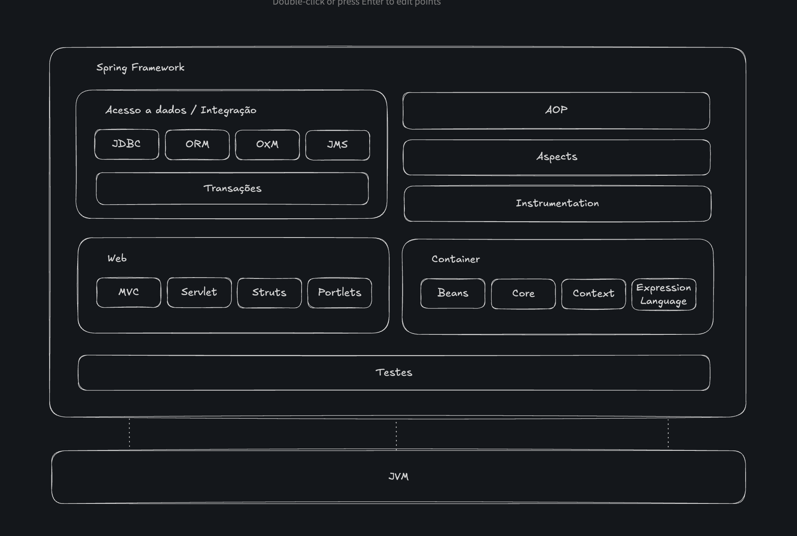

# Spring em Partes

É importante observar que como requisito básico de funcionamento não temos um servidor de aplicações ou Servlets, mas apenas a JVM.

Antes do Spring, se você queria rodar uma aplicação corporativa em Java, era quase obrigatório usar um servidor de aplicações “pesado”, como JBoss, WebLogic ou WebSphere.

* Esses servidores ofereciam suporte a EJBs, gerenciamento de transações, segurança, injeção de dependência, etc.

* Só que eram caros, complexos e pesados, exigindo bastante infraestrutura.

Combinando IoC (Inversão de Controle) + DI (Injeção de Dependências) + AOP (Programação Orientada a Aspectos), o Spring conseguiu recriar essas capacidades dentro do próprio framework, sem precisar de toda a infraestrutura de um servidorzão.

* Ou seja, o Spring simulava boa parte das funcionalidades corporativas da Java EE, mas de forma muito mais leve e flexível.

Por isso: 

* Em vez de usar um servidor de aplicação completo, você podia rodar sua aplicação Spring em um servidor de Servlets simples (como Tomcat ou Jetty).

* Esses servidores só precisavam se preocupar em receber requisições HTTP e repassá-las pro Spring, que cuidava do resto (injeção, transações, aspectos, etc.).

* O resultado prático era o mesmo: você tinha uma aplicação corporativa robusta, mas sem a burocracia e o peso da stack Java EE tradicional.

O Spring “emancipou” os desenvolvedores Java da dependência de servidores de aplicação pesados, permitindo rodar aplicações corporativas completas em servidores leves, graças ao poder combinado de IoC + DI + AOP.

---
